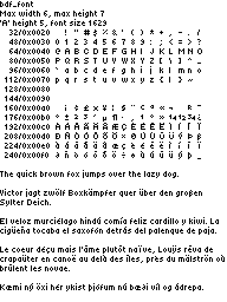

# font_tiny5

font_tiny5 is a variable-width 5-pixel font that draws inspiration from the renowned Helvetica font. Its design prioritizes legibility, making it suitable for low-resolution LCD displays. It encompasses the entirety of Unicode blocks 0 and 1.

## Tools

font_tiny5 was designed with [Fony](http://hukka.ncn.fi/?fony), converted to SFD format with [vfontas](https://manpages.ubuntu.com/manpages/kinetic/man1/vfontas.1.html) (hxtools), and post-edited with [Font Forge](https://fontforge.org/).

## Overview

