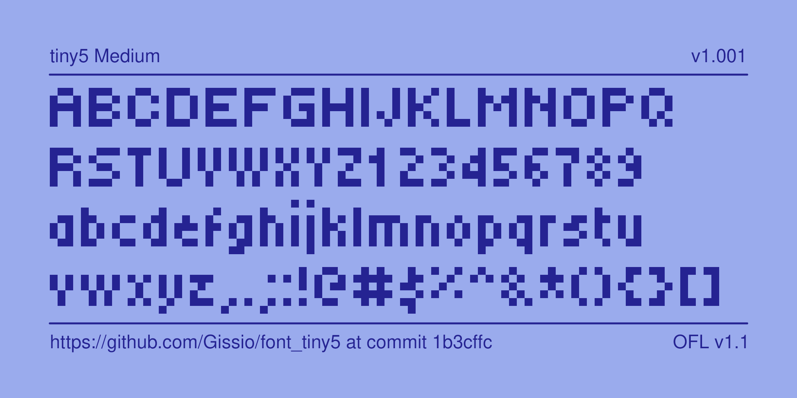
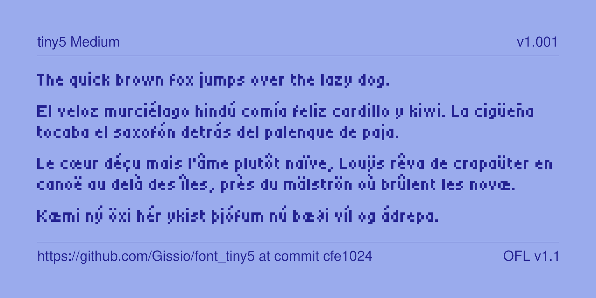

# font_tiny5

font_tiny5 is a variable-width, 5-pixel font playing with the concept of least amount of information that produces both legible and aesthetically pleasing text.

It is aimed at digital media such as websites, mobile apps and, especially, monochrome LCD displays.

Each of font_tiny5's glyphs was carefully crafted to be visually appealing and easy to read at any size. font_tiny5 supports Unicode planes 0 and 1.

The font is also available in [BDF](https://en.wikipedia.org/wiki/Glyph_Bitmap_Distribution_Format) format for easy integration with the [mcu-renderer](https://github.com/Gissio/mcu-renderer) and [u8g2](https://github.com/olikraus/u8g2) libraries.

## Overview

## Sample

## Changelog

### 1.0.1

* Fixed alignment of the the Ì, Ï, ì, ï glyphs.

### 1.0.0

* First release.

## Acknowledgements 

font_tiny5 was designed by Stefan Schmidt using [Bits'N'Picas](https://github.com/kreativekorp/bitsnpicas) and [FontForge](https://fontforge.org/).

## License

This Font Software is licensed under the SIL Open Font License, Version 1.1. This license is available with a FAQ at: https://scripts.sil.org/OFL
