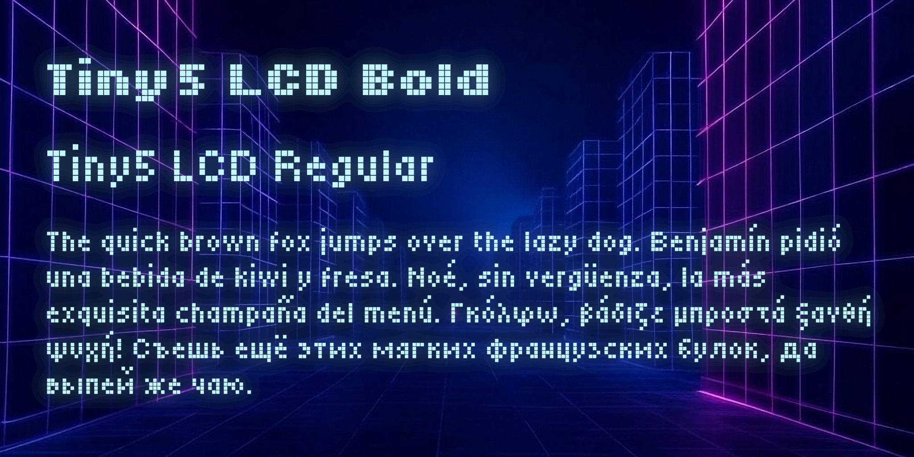
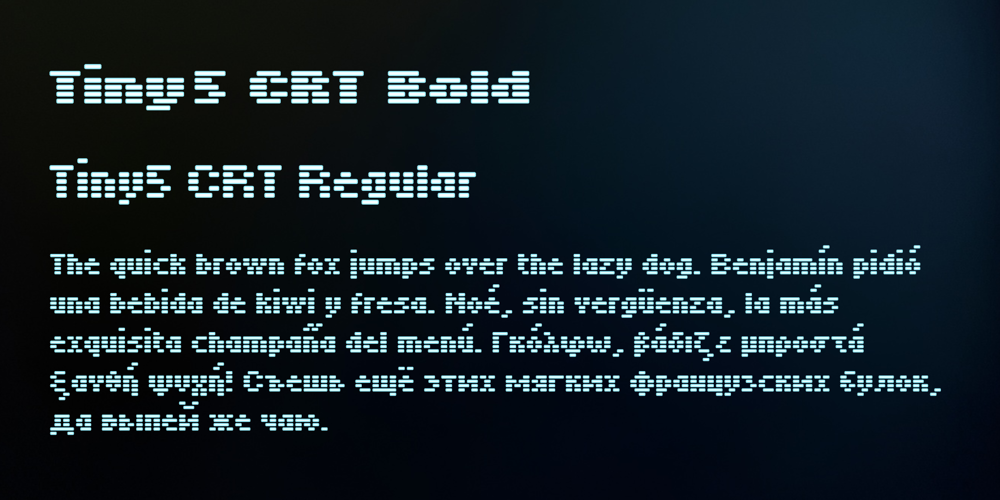
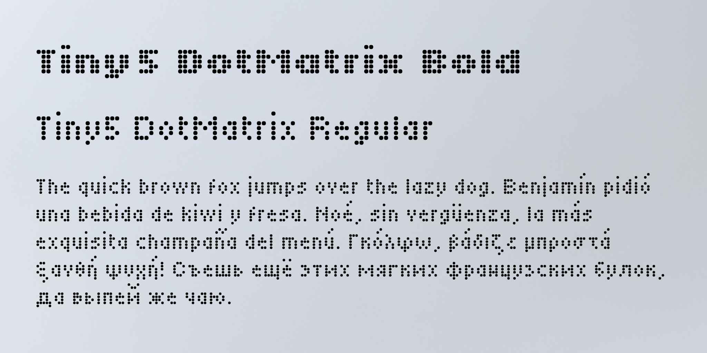

# Tiny5

Tiny5 is a 5-pixel variable font inspired by the graphing calculators and digital gadgets of the 1980s-90s, where the constraints of limited pixel space demanded efficient and minimalist design.

It features three variable axes: pixel volume, roundness and bleed. These allow to mimic the visual characteristics of LCD screens, CRT monitors and dot matrix printouts.

Tiny5 is perfect for evoking a retro or nostalgic feel, for conveying the idea of minimalism, or for efficiently presenting information on small displays.

Tiny5 supports the Google Fonts Latin Kernel, Latin Core, Latin Plus, Latin Beyond, Latin African, Latin PriAfrican, Latin Vietnamese, Greek Core, Greek Plus, Greek Pro, Cyrillic Core and Cyrillic Plus character set.

The font is also available in [BDF](https://en.wikipedia.org/wiki/Glyph_Bitmap_Distribution_Format) format for easy integration with the [mcu-renderer](https://github.com/Gissio/mcu-renderer), [u8g2](https://github.com/olikraus/u8g2) and [TFT_eSPI](https://github.com/Bodmer/TFT_eSPI) libraries.

## Samples

# Releases

## 2.000

* Added variable font support for control of pixel volume, roundness and bleed.
* Added Tiny5 Bold weight.
* Added Google Fonts Latin Beyond, Latin PriAfrican, Latin Vietnamese, Greek Plus and Greek Pro character sets.
* Major corrections to the greek and cyrillic character sets.

## 1.002

* Added Google Fonts Greek Core, Cyrillic Core and Cyrillic Plus character sets.

## 1.001

* Added Google Fonts Latin Plus and Latin African character sets.
* Major corrections.

## 1.000

* First release.

## Build

With Python 3.10 or newer, pip and virtualenv installed, run this command:

    ./build.sh

## Designer profile

Stefan Schmidt is an electrical engineer with graduate studies in signal processing, combined artistic languages and sociology. Fascinated by the interplay between the virtual and the real, his work probes the boundaries between perception and technology.

Learn more at [http://www.stefanschmidtart.com](http://www.stefanschmidtart.com).

## License

This Font Software is licensed under the SIL Open Font License, Version 1.1. This license is available with a FAQ at: https://scripts.sil.org/OFL
